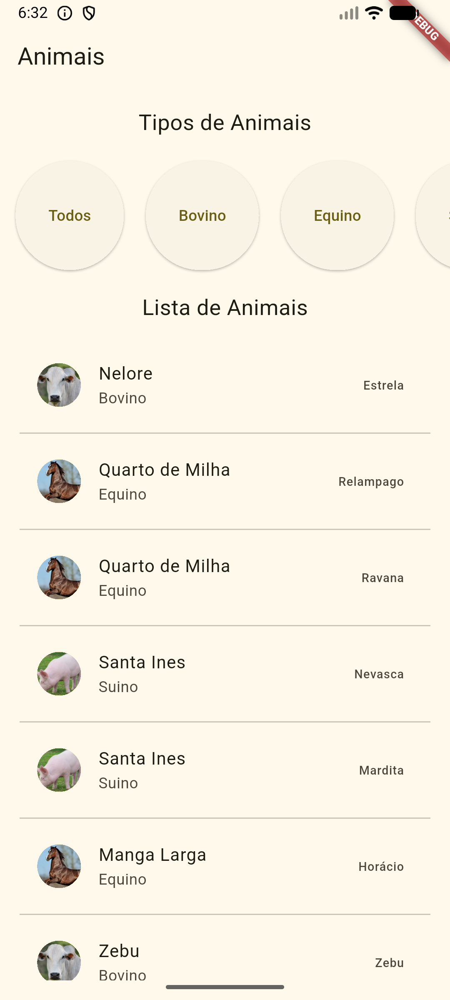
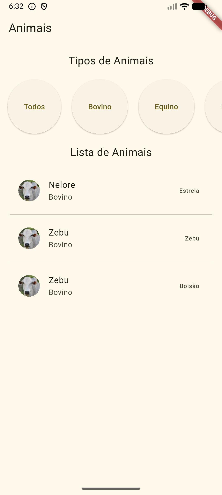
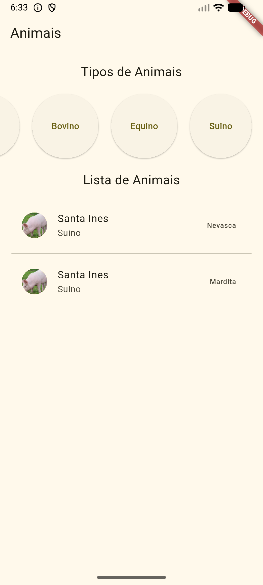
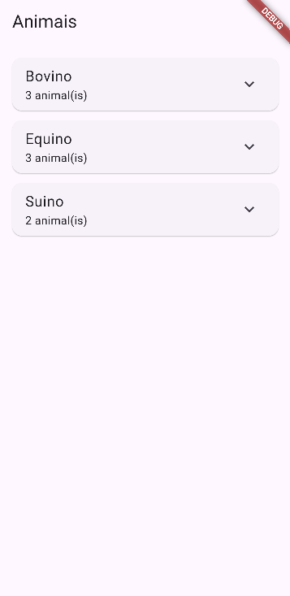
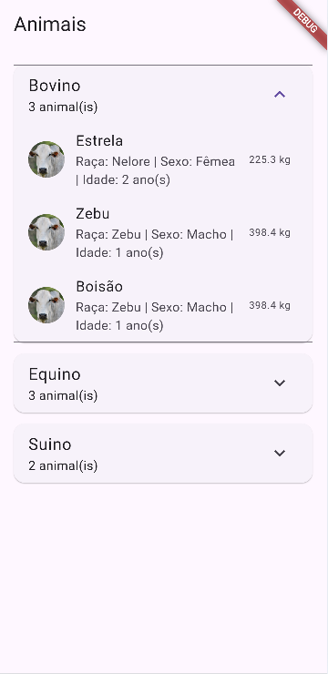
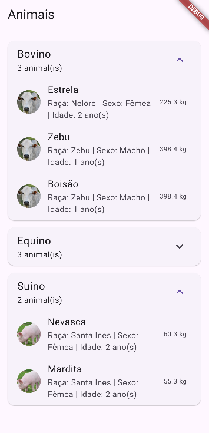

# Exemplo de listas e filtros

Exemplo de utilização de listas, filtros, linhas e colunas com Flutter

## Tecnologias
- Flutter
- VsCode
- Android Studio

## Passos para testar
- 1 Clone este repositório
- 2 Abra com VsCode e em um terminal execute:
```bash
flutter pub get
flutter run
```

## Prints das telas
||||
|-|-|-|
|Sem Filtro|Bovinos|Suínos|"# flutter_exp_listas_filtros_row_column_animais_2026" 

## Mostrando a mesma lista em cards tipo "Sanfona"
Copie o código a seguir e cole no arquivo lib/main.dart
```dart
import 'package:flutter/material.dart';

void main() {
  runApp(MainApp());
}

class MainApp extends StatefulWidget {
  const MainApp({super.key});

  @override
  State<MainApp> createState() => _MainAppState();
}

class _MainAppState extends State<MainApp> {
  List<dynamic> animais = [
    {
      "id": "78412",
      "tipo": "Bovino",
      "nome": "Estrela",
      "sexo": "Fêmea",
      "peso": 225.3,
      "idade": 2,
      "abate": 2.5,
      "raca": "Nelore",
      "lote": 123,
      "imagem": "1729798538466.jpg",
    },
    {
      "id": "35798",
      "tipo": "Equino",
      "nome": "Relampago",
      "sexo": "Macho",
      "peso": 250,
      "idade": 1,
      "abate": 15,
      "raca": "Quarto de Milha",
      "lote": 121,
      "imagem": "1729803527343.png",
    },
    {
      "id": "35780",
      "tipo": "Equino",
      "nome": "Ravana",
      "sexo": "Fêmea",
      "peso": 250,
      "idade": 1,
      "abate": 15,
      "raca": "Quarto de Milha",
      "lote": 121,
      "imagem": "1729803527343.png",
    },
    {
      "id": "96412",
      "tipo": "Suino",
      "nome": "Nevasca",
      "sexo": "Fêmea",
      "peso": 60.3,
      "idade": 2,
      "abate": 2.2,
      "raca": "Santa Ines",
      "lote": 123,
      "imagem": "1729803538413.png",
    },
    {
      "id": "96412",
      "tipo": "Suino",
      "nome": "Mardita",
      "sexo": "Fêmea",
      "peso": 55.3,
      "idade": 2,
      "abate": 2.2,
      "raca": "Santa Ines",
      "lote": 123,
      "imagem": "1729803538413.png",
    },
    {
      "id": "52147",
      "tipo": "Equino",
      "nome": "Horácio",
      "sexo": "Macho",
      "peso": 350.1,
      "idade": 2,
      "abate": 20,
      "raca": "Manga Larga",
      "lote": 123,
      "imagem": "1729803527343.png",
    },
    {
      "id": "85473",
      "tipo": "Bovino",
      "nome": "Zebu",
      "sexo": "Macho",
      "peso": 398.4,
      "idade": 1,
      "abate": 2.5,
      "raca": "Zebu",
      "lote": 121,
      "imagem": "1729798538466.jpg",
    },
    {
      "imagem": "1729798538466.jpg",
      "tipo": "Bovino",
      "nome": "Boisão",
      "sexo": "Macho",
      "peso": 398.4,
      "idade": 1,
      "abate": 2.5,
      "raca": "Zebu",
      "lote": 121,
      "id": "85474",
    },
  ];

  @override
  Widget build(BuildContext context) {
    final Map<String, List<Map<String, dynamic>>> animaisPorTipo = {};

    for (final item in animais) {
      final animal = Map<String, dynamic>.from(item as Map);
      final tipo = animal['tipo'] as String? ?? 'Sem tipo';
      animaisPorTipo.putIfAbsent(tipo, () => []).add(animal);
    }

    return MaterialApp(
      home: Scaffold(
        appBar: AppBar(title: Text('Animais')),
        body: Padding(
          padding: EdgeInsets.all(16.0),
          child: ListView(
            children: animaisPorTipo.entries.map((entry) {
              final tipo = entry.key;
              final lista = entry.value;

              return Card(
                margin: EdgeInsets.only(bottom: 12),
                child: ExpansionTile(
                  title: Text(tipo, style: const TextStyle(fontSize: 18)),
                  subtitle: Text('${lista.length} animal(is)'),
                  children: lista.map((animal) {
                    return ListTile(
                      leading: CircleAvatar(
                        backgroundImage: NetworkImage(
                          'https://raw.githubusercontent.com/wellifabio/agro-api-jserver-swagger/refs/heads/main/uploads/${animal['imagem']}',
                        ),
                      ),
                      title: Text(animal['nome'].toString()),
                      subtitle: Text(
                        'Raça: ${animal['raca']} | Sexo: ${animal['sexo']} | Idade: ${animal['idade']} ano(s)',
                      ),
                      trailing: Text('${animal['peso']} kg'),
                    );
                  }).toList(),
                ),
              );
            }).toList(),
          ),
        ),
      ),
    );
  }
}
```
||||
|-|-|-|
|Sem Filtro|Bovinos|Suínos|
